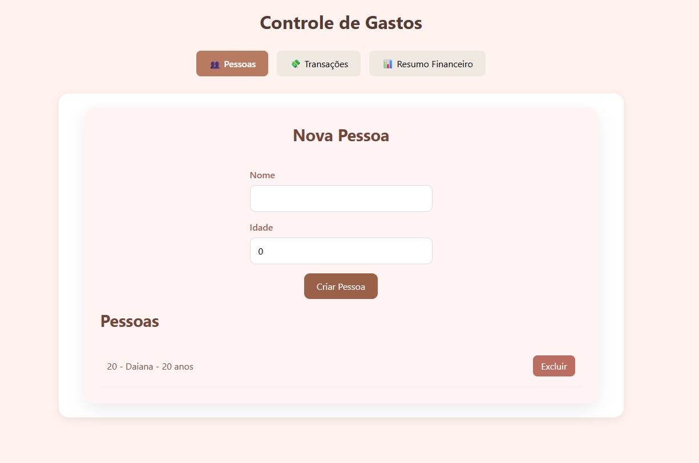
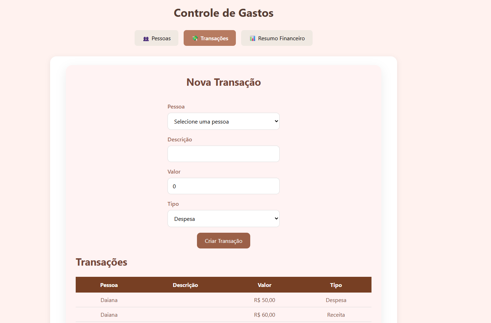
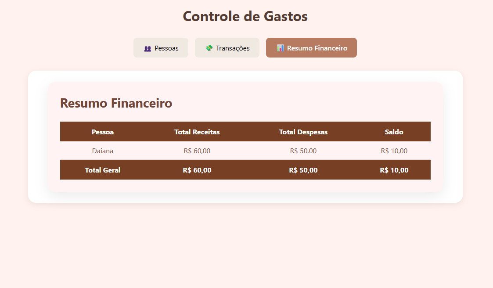

# 💰 Controle de Gastos Residenciais
Aplicação Full Stack desenvolvida com ASP.NET Core Web API, Entity Framework Core, SQLite, React e TypeScript para gerenciamento de receitas, despesas e acompanhamento financeiro por pessoa.

---

## 📸 Funcionalidades

- Cadastro de pessoas
- Exclusão de pessoas (com exclusão em cascata das transações)
- Cadastro de receitas e despesas
- Regra de negócio para menores de idade
- Listagem de pessoas
- Listagem de transações
- Resumo financeiro por pessoa
- Totais gerais do sistema
- Atualização automática da interface após operações
- Navegação por abas

---

## 🛠 Tecnologias Utilizadas

### Back-end

- C#
- ASP.NET Core Web API
- Entity Framework Core
- SQLite
- Scalar API
- OpenAPI

### Front-end

- React
- TypeScript
- CSS
- Fetch API

---

## 📂 Estrutura do Projeto

```
ControleGastos/

├── Backend/
│   ├── Controllers
│   ├── Data
│   ├── DTOs
│   ├── Models
│   ├── Services
│   └── Migrations
│
└── Frontend/
    ├── components
    │   ├── Pessoas
    │   ├── Transacoes
    │   └── Relatorios
    ├── services
    ├── types
    └── utils
```

---

## 📌 Regras de Negócio

- Apenas pessoas cadastradas podem possuir transações.
- Ao excluir uma pessoa, todas as suas transações são removidas automaticamente (Cascade Delete).
- Pessoas menores de 18 anos não podem cadastrar transações do tipo **Receita**.
- O resumo financeiro é atualizado automaticamente após qualquer alteração.

---

## 🧱 Arquitetura

### Back-end

O projeto utiliza uma arquitetura em camadas:

- Controllers
- Services
- DTOs
- Models
- Data (Entity Framework)

A lógica de negócio permanece centralizada na camada de Services, enquanto os Controllers ficam responsáveis apenas pelas requisições HTTP.

---

### Front-end

A aplicação React foi organizada utilizando:

- Components
- Services
- Types
- Utils

O `App.tsx` atua como componente orquestrador da aplicação, centralizando o estado global e distribuindo callbacks entre os componentes filhos para manter a interface sincronizada após cada operação.

---

## 📋 Pré-requisitos

Antes de executar o projeto, certifique-se de possuir instalado:

- .NET SDK 10.0
- Node.js 22 ou superior
- npm
- Git

Opcionalmente, recomenda-se utilizar:

- Visual Studio 2026 ou Visual Studio Code

---

## 🚀 Como executar

### Back-end

```bash
dotnet restore

dotnet ef database update

dotnet run
```

A API será iniciada em:

```
http://localhost:5141
```

A documentação da API (Scalar) estará disponível em:

```
http://localhost:5141/scalar/v1
```
---

### Front-end

```bash
npm install

npm run dev
```

---

## 📷 Interface

A aplicação possui três módulos principais:

- 👥 Pessoas
- 💸 Transações
- 📊 Resumo Financeiro

### Cadastro de Pessoas



---

### Cadastro de Transações



---

### Resumo Financeiro



---

## 📚 Conceitos aplicados

- Arquitetura em camadas
- Componentização
- Comunicação entre componentes (Props)
- Hooks (`useState` e `useEffect`)
- Programação assíncrona (`async/await`)
- Fetch API
- Entity Framework Core
- DTOs
- Injeção de Dependência
- Separação de responsabilidades
- Clean Code
- Conventional Commits

---

## 👩‍💻 Autora

Desenvolvido por **Daiana** como projeto de estudo para aprofundamento em desenvolvimento Full Stack com ASP.NET Core e React.
